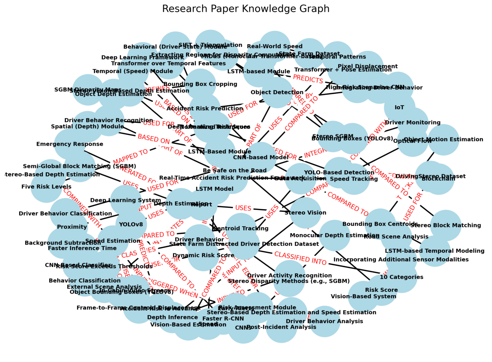
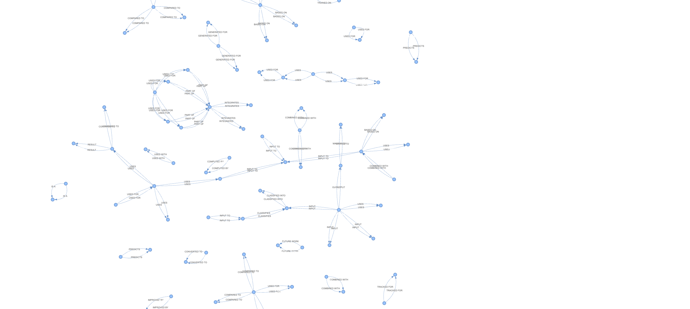

# 🌌 **The Research Cartographer**

### *Exploring, Mapping, and Understanding Scientific Worlds with AI*

<p align="center">  </p>


---

# 🧩 **1. The Problem: Research Shouldn’t Feel Like Archaeology**

Reading a research paper sometimes feels like digging through an ancient ruin:

* Methods are buried somewhere between equations
* Datasets are mentioned in a passing footnote
* Results hide inside tables and plots
* And when you try to compare **two** papers?
  You end up juggling PDFs, tabs, and sanity

Researchers deserve better tools.
Students deserve clearer explanations.
Science deserves systems that illuminate, not obscure.

---

# ⭐ **2. The Solution: A Cartographer for Scientific Ideas**

**The Research Cartographer** is an AI agent that treats every research paper as a *new world waiting to be mapped.*

Instead of summarizing text, it **reveals structure**:

* Who are the key actors (methods, models, datasets)?
* How do they interact?
* What flows into what?
* What relationships define the study?

This agent extracts the **semantic blueprint underneath the paper**, turning it into:

### 🌐 Interactive Knowledge Graphs

### 🎨 Static Colored Graphs

### ⭐ Insight Cards (Top Methods, Datasets, Results)

### 🤖 Intelligent Q&A

### ⚔️ Side-by-Side Comparisons of Multiple Papers

It is not a summarizer.
It is a **navigator**, a **cartographer**, a **translator** of scientific complexity.

---

# 🧠 **3. Architecture: From PDF to Knowledge Universe**

Below is an expressive diagram of how the system thinks:

```
                    ┌───────────────────────────────┐
                    │     1. PDF Uploaded            │
                    └──────────────┬────────────────┘
                                   ↓
                    ┌───────────────────────────────┐
                    │ 2. Text Excavation Engine      │
                    │ (extracts meaning from PDF)    │
                    └──────────────┬────────────────┘
                                   ↓
   ┌─────────────────────────────────────────────────────────────────────────┐
   │               3. Cartographer Agent (LLM Semantic Mapper)              │
   │   Converts raw text into relationships:                                │
   │     [Model] -> TRAINS_ON -> [Dataset]                                  │
   │     [Method] -> ACHIEVES -> [Result]                                   │
   │     [Framework] -> INTEGRATES -> [Components]                          │
   └───────────────────────┬─────────────────────────────────────────────────┘
                            ↓
        ┌──────────────┬───────────────┬────────────────┬────────────────┐
        ↓              ↓               ↓                ↓               ↓
┌────────────┐  ┌──────────────┐  ┌─────────────────┐ ┌───────────────┐
│ Insight    │  │ Static Graph │  │ Interactive Map │ │ Navigator Q&A │
│ Extraction │  │ (NetworkX)   │  │   (PyVis)       │ │    Agent      │
└────────────┘  └──────────────┘  └─────────────────┘ └───────────────┘
                            ↓
                ┌─────────────────────────┐
                │ 5. Comparison Engine    │
                │  Compare two universes  │
                └─────────────────────────┘
```

Think of it as:

> **“Turning a paper’s text into a living, navigable universe.”**

---

# 🎨 **4. What the Cartographer Creates**

### 🧬 **Knowledge Triples**

These are the DNA strands of the research:

```
[CNN Classifier] -> CLASSIFIES -> [Driver Behavior]
[Stereo Images] -> PROVIDE -> [Depth Cues]
[LSTM Module] -> COMPUTES -> [Risk Score]
```

### ⭐ **Insight Cards**

* Top Methods
* Top Datasets
* Top Results

A quick, intuitive overview — like reading the paper’s genetic summary.

### 🎨 **Static Graph**

Color-coded, structured, printable.

<p align="center">
  
</p>

### 🌐 **Interactive Graph**

Drag, zoom, hover, explore.

<p align="center">
  
</p>

### ❓ **Ask Anything About the Paper**

The Navigator Agent answers questions like a patient research mentor.

### ⚔️ **Compare Two Papers**

A duel of ideas:
Where do they converge?
Where do they diverge?
Which components do they share?

---

# 🔥 **5. Why This Matters**

Because research should feel like **exploration**, not excavation.
Because understanding should feel like **navigation**, not decoding.
Because students and researchers deserve tools that help them think, not just read.

This system turns papers into maps —
and maps turn confusion into clarity.

---

# 🛠️ **6. Installation & Setup**

### **1️⃣ Clone the repository**

```bash
git clone https://github.com/your-username/research-cartographer.git
cd research-cartographer
```

### **2️⃣ Create Conda environment**

```bash
conda env create -f environment.yml
conda activate my_cartographer
```

### **3️⃣ Add your Gemini API key (securely)**

**Do NOT hardcode your key.**

Mac/Linux:

```bash
export GOOGLE_API_KEY="your_key_here"
```

Windows:

```powershell
setx GOOGLE_API_KEY "your_key_here"
```

### **4️⃣ Launch the Streamlit app**

```bash
streamlit run app.py
```

This opens:

👉 [http://localhost:8501](http://localhost:8501)

Upload a PDF → Explore → Compare → Speak with the paper.

---

# 📦 **7. Project Structure**

```
The-Research-Cartographer/
│
├── app.py                      # Streamlit dashboard
├── main.py                     # Command line runner
├── environment.yml             # Conda environment
│
├── agents/
│   ├── cartographer.py         # AI triple extractor
│   └── navigator.py            # Q&A agent
│
├── tools/
│   ├── pdf_parser.py           # PDF text extraction
│   ├── graph_visualizer.py     # Static graph generator
│   └── graph_interactive.py    # Interactive graph JS engine
│
└── assets/                     # Images, banners, examples
```

---

# 🚀 **8. Future Vision**

* Full long-document semantic stitching
* Extract tables, equations, citation graphs
* Auto-generate literature review summaries
* Build clusters of related papers
* Multi-agent collaboration across disciplines

Imagine a world where reading 100 papers feels like reading 1.

---

# 🤝 Contributing

Contributions are welcome!
Just fork the repo, create a branch, and submit a PR.

--- 

# ⭐ Support the Project

If you find this useful, please:

⭐ Star the repository

🔁 Share it with your peers

🐛 Report bugs

💡 Suggest new features

---

# 🎉 Final Thought

Science is a landscape.
Research papers are continents.
And The Research Cartographer is your mapmaker.

Let every paper become a world you can explore.

---

